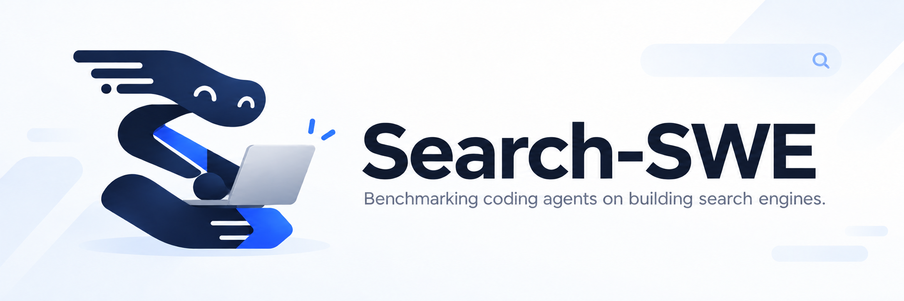

<p align="center">
  
</p>

<h1 align="center">
  Search-SWE
  <br>
  <sub>🔍 Benchmarking coding agents on building search engines. 🤖</sub>
</h1>

<p align="center">
  <a href="https://search-swe.github.io/"></a>
  <a href="https://search-swe.github.io/tasks.html"></a>
  <a href="https://huggingface.co/datasets/search-swe/Search-SWE"></a>
  <a href="LICENSE"></a>
</p>

<p align="center">
  <b>English</b> · <a href="README_zh.md">简体中文</a>
</p>

> *Note: Search-SWE is an ongoing project; tasks, documentation, and results
> are still evolving.*

## 📖 Overview

Search-SWE evaluates whether coding agents can **implement and optimize** real
search systems under fixed resource constraints. Agents inspect an environment,
write and run code, test their systems, and iterate toward an executable
submission. Evaluation measures the behavior of the resulting system, including
retrieval quality, functional correctness, and resource use.

Tasks cover reasoning-assisted retrieval, memory-constrained vector search,
long-document reranking, embedding fine-tuning, and query-encoder alignment.

Each task specifies its inputs, submission interface, evaluation criteria, and
resource budget. See the [benchmark design](docs/benchmark.md) for how
evaluation works, how the repository is organized, and where fixed data and
models come from.

## 🚀 Quick Start

This walkthrough runs `reasoning-query-rewriting` on CPU with the Pi coding agent and DeepSeek
Flash. Search-SWE requires Python 3.12 or newer and Docker with the CPU, memory,
storage, and optional GPU capacity of the task you select.

### 1. Install the host tools

```bash
git clone https://github.com/VectorSpaceLab/Search-SWE.git
cd Search-SWE
python -m pip install -r scripts/requirements.txt
```

`scripts/requirements.txt` provides the pinned Harbor launcher and the Hugging
Face asset client. Run the command in any existing Python 3.12+ environment;
an isolated venv or Conda environment is recommended if you do not already use
one, but no particular environment manager is required. Task-specific Python
packages are installed inside Docker.

### 2. Restore the task inputs

```bash
python scripts/download_assets.py --task reasoning-query-rewriting
python scripts/download_assets.py --task reasoning-query-rewriting --verify-only
```

The downloader checks sizes and SHA-256 checksums and reuses valid files.

### 3. Configure the agent and verifier

The tracked template lists every supported credential and explains when each
one is needed. Copy it once; put real secrets only in the ignored `.env` file:

```bash
cp .env.example .env
chmod 600 .env
```

For this Pi + DeepSeek walkthrough, set these four values in `.env` and leave
unneeded groups empty:

```dotenv
AGENT_MODEL=deepseek/deepseek-flash
DEEPSEEK_API_KEY=YOUR_DEEPSEEK_KEY
VERIFIER_OPENAI_BASE_URL=https://openrouter.ai/api/v1
VERIFIER_OPENAI_API_KEY=YOUR_OPENROUTER_KEY
```

`DEEPSEEK_API_KEY` authenticates the Pi agent for `deepseek/deepseek-flash`.
The `VERIFIER_*` pair runs the independent `deepseek/deepseek-v4.1-flash` trajectory judge
through OpenRouter and RewardKit 0.2.0 and is required by every task except
`agentic-search`. Use an OpenRouter key for `VERIFIER_OPENAI_API_KEY`; the Pi agent
uses its separate DeepSeek key. The launcher passes verifier credentials only
to the verifier container.

For other runs, fill only the matching sections already present in `.env`:

- Pi + GLM-5.3-Flash: `AGENT_MODEL=zai/glm-5.3-flash` and `ZAI_API_KEY`.
- Codex: `AGENT_MODEL`, `AGENT_OPENAI_BASE_URL`, and `AGENT_OPENAI_API_KEY`.
- Claude Code: `AGENT_MODEL` and `AGENT_ANTHROPIC_API_KEY`; the launcher uses
  Anthropic's official API by default.
- OpenRouter Agent mode: `AGENT_OPENROUTER_API_KEY`, `--openrouter`, and a full
  `provider/model` slug with Codex or Claude Code.
- `scientific-paper-qa`: the three `ANSWER_JUDGE_*` values are also required.
- Optional submission APIs: use `REASONING_QUERY_REWRITING_OPENROUTER_API_KEY`,
  `OPENROUTER_API_KEY`, or `JINA_API_KEY` only for the tasks identified by the
  comments in `.env.example`.

If a proxy is required, set `EGRESS_CONFIG` in `.env` following the
[network guide](docs/network-policy.md); otherwise leave it empty.

The [evaluation guide](docs/evaluation.md) documents credential isolation,
custom endpoints, proxies, and the complete per-task matrix.

### 4. Run with Pi and DeepSeek Flash

```bash
bash scripts/run_task.sh --task reasoning-query-rewriting --agent pi \
  --thinking xhigh --dry-run

bash scripts/run_task.sh --task reasoning-query-rewriting --agent pi \
  --thinking xhigh \
  --output jobs/reasoning-query-rewriting-pi-deepseek
```

The dry run only prints the Harbor command. The second command builds the task
images, runs the agent and the separate verifier, and writes the reward and job
records under `jobs/reasoning-query-rewriting-pi-deepseek`.

<details>
<summary><strong>Alternative agent examples</strong></summary>

These examples reuse the downloaded task inputs and the `VERIFIER_*` pair above.
Configure only the coding-agent credential group for the option you choose.

#### Pi and Z.AI GLM-5.3-Flash

In `.env`, change the agent model and fill its matching key. Keep the
`VERIFIER_*` OpenRouter judge settings because the RewardKit judge does not change:

```dotenv
AGENT_MODEL=zai/glm-5.3-flash
ZAI_API_KEY=YOUR_ZAI_KEY
```

```bash
bash scripts/run_task.sh --task reasoning-query-rewriting --agent pi \
  --thinking xhigh \
  --output jobs/reasoning-query-rewriting-pi-glm
```

#### Codex and a GPT model

Set the model name accepted by your GPT-compatible endpoint and its credentials:

```dotenv
AGENT_MODEL=YOUR_GPT_MODEL
AGENT_OPENAI_BASE_URL=https://your-agent-endpoint.example/v1
AGENT_OPENAI_API_KEY=YOUR_AGENT_KEY
```

```bash
bash scripts/run_task.sh --task reasoning-query-rewriting --agent codex \
  --reasoning-effort xhigh --output jobs/reasoning-query-rewriting-codex
```

Omit `--reasoning-effort` when the selected model or provider does not support
it.

#### Claude Code and the official Anthropic API

Claude Code 2.1.283 is preinstalled in every task image. Set an Anthropic model
available to your API account and the dedicated coding-agent key:

```dotenv
AGENT_MODEL=claude-sonnet-4-6
AGENT_ANTHROPIC_API_KEY=YOUR_ANTHROPIC_KEY
```

```bash
bash scripts/run_task.sh --task reasoning-query-rewriting --agent claude-code \
  --reasoning-effort high --output jobs/reasoning-query-rewriting-claude
```

#### Codex or Claude Code through OpenRouter

Add a dedicated OpenRouter Agent key to `.env`:

```dotenv
AGENT_OPENROUTER_API_KEY=YOUR_AGENT_OPENROUTER_KEY
```

Choose an Agent and pass its full OpenRouter model ID:

```bash
bash scripts/run_task.sh --task reasoning-query-rewriting --agent codex --openrouter \
  --model openai/gpt-6-astra --reasoning-effort xhigh \
  --output jobs/reasoning-query-rewriting-codex-openrouter

bash scripts/run_task.sh --task reasoning-query-rewriting --agent claude-code --openrouter \
  --model anthropic/claude-opus-5.5 --reasoning-effort xhigh \
  --output jobs/reasoning-query-rewriting-claude-openrouter
```

Add `--dry-run` to either command to preview it before launching. The launcher
sets the OpenRouter API addresses and keeps this key separate from the
submission `OPENROUTER_API_KEY` and verifier credentials. Keep the `VERIFIER_*`
settings from the main example.

Other custom gateways, subscription OAuth, Bedrock, Vertex, ACP, and custom
Claude settings remain outside the supported scope. The
[quick start guide](docs/quickstart.md) covers the default Codex path;
the [evaluation guide](docs/evaluation.md) covers the per-task credential and
hardware matrix plus GPU, network-policy, and custom-provider options.

</details>

## 📚 Documentation

| Document | Contents |
| --- | --- |
| [Quick start guide](docs/quickstart.md) | A first CPU evaluation, end to end |
| [Evaluation guide](docs/evaluation.md) | Per-task credentials, coding agents, GPU, network policy, and custom providers |
| [Network policy](docs/network-policy.md) | Per-task allowlists, default direct gateway, and optional proxy egress |
| [Asset guide](docs/assets.md) | Downloading, verifying, and restoring fixed data and models |
| [Benchmark design](docs/benchmark.md) | Evaluation, repository layout, and data provenance |
| [Contributing guide](docs/contributing.md) | Task-authoring workflow, validation, and PR expectations |

For task descriptions and results, visit the
[project website](https://search-swe.github.io/), maintained in a
[separate repository](https://github.com/search-swe/search-swe.github.io).

## 🤝 Contributing

Contributions are welcome. For new or substantially revised tasks, start with
the workflow and skills in [`.agents/`](.agents/AGENTS.md), including
[`create-searchswe-task`](.agents/skills/create-searchswe-task/SKILL.md) for submissions
and [`maintain-searchswe-task`](.agents/skills/maintain-searchswe-task/SKILL.md) for
PR review and promotion. See the
[contribution entry](CONTRIBUTING.md) and [guide](docs/contributing.md) for validation and PR requirements.

Task authoring includes running a configured coding model, inspecting its
trajectory and evaluation results, and using that feedback to refine the task
setting. Revalidate any changes that affect the task or scoring and report the
final tested revision. If required API keys are missing, the authoring agent
asks the contributor to configure them locally before the trial.

New tasks use `task-submissions/<task-name>`. Choose a descriptive name of at
most five lowercase, hyphen-separated words; use that same name for the formal
package and its official data. One PR may add multiple tasks. Maintainers
promote each reviewed package to `tasks/<task-name>` in the same PR, with a
separate pure move and finalization. Preserve original authors with a merge
commit; no unfinished submission enters main.

Development assets may use a personal public HF dataset pinned to a commit SHA.
Publish official inputs under `tasks/<task-name>/`, then pin the merged official
HF SHA before merging the GitHub contribution. Explicit `--task-path` supports
submission downloads and local trials; `--task <task-name>` selects a formal task.

## Citation

TBA
